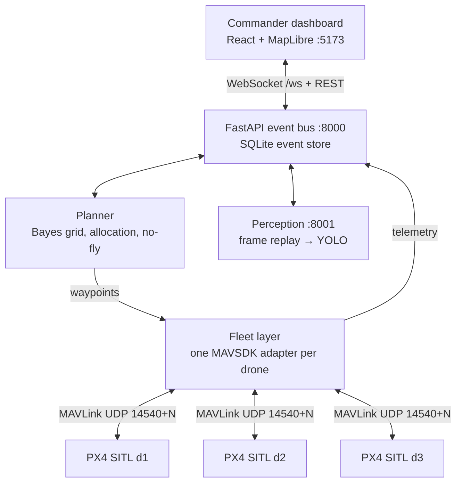

# TRAAN

**AI mission brain for drone and ground-robot search-and-rescue: Bayesian search, air–ground teaming, compliance by design.**

TRAAN decides where a search fleet should look next, coordinates several autonomous drones,
updates its probability map from what they did and didn't find, and leaves the final call to a human operator.

> Status: **≈46% of the prototype** (see the table below), ahead of the 14-day plan that starts 4 Oct.
> The Find loop runs on 3 PX4 SITL drones. Everything is simulation: PX4 SITL, thermal *frame replay*.
> No real aircraft, no live camera, and **no trained detector yet** (HIT-UAV + YOLO is the next step).


<sub>Commander dashboard during a run with 3 PX4 SITL drones (blue) after the operator confirmed a detection (green).
Orange = probability heatmap; the searched middle has cleared. Red box = no-fly zone. The thermal frame in the card is
a **placeholder used to test the wiring**, not a HIT-UAV frame, and the detector was the label oracle. Basemap tiles
were not loaded in this capture.</sub>

## The Find loop

**Alert pin → prior heatmap → 3 PX4 drones fly the planner's waypoints → heatmap updates live →
a HIT-UAV thermal frame triggers a YOLO detection → operator confirms → map updates, search continues.**

## Architecture



There is one live planner, inside the API. Fleets (the mock today, PX4 via `fleet/run.py` from Day 4)
post telemetry, which the planner turns into negative-information map updates, and ask
`POST /planner/next` for each drone's next leg. Interface contracts (the four event types, the live-loop
REST calls, coordinates, grid, ports, ownership rules) are frozen in [`CLAUDE.md`](CLAUDE.md).

## Quick start

```bash
git clone https://github.com/rahulpravash-design/traan.git && cd traan
docker compose up            # api + mock fleet + dashboard, no PX4 needed
# open http://localhost:5173  → the mock fleet sends a scenario alert and starts searching;
# "Drop alert pin" re-centres the search (the mock's hidden victims stay where they are)
```

Without Docker:

```bash
pip install -r requirements.txt
./data/fetch.sh                                   # SRTM tile + OSM extract (optional; synthetic terrain otherwise)
uvicorn api.main:app --port 8000 &
python -m fleet.mock_feed --seed 1 --speedup 5 &   # add --wait-for-pin to start from your own pin
cd dashboard && npm install && npm run dev
```

With PX4 SITL (headless SIH, 3 drones):

```bash
docker compose --profile px4 up px4-sitl          # or: PX4_DIR=~/PX4-Autopilot ./fleet/px4_sitl.sh 3
pip install -r fleet/requirements.txt
python -m fleet.smoke_test --drones 3             # Day 1 check: arm, take off, land
python -m fleet.run --drones 3                    # live loop: fly the API planner's legs (Day 4 check)
```

Verified on PX4 v1.15.4 SITL (SIH, headless, Ubuntu 24.04): the smoke test passes and 3 drones fly the
planner's legs from Ooty. Shallow clones need `git -C platforms/nuttx/NuttX/nuttx tag nuttx-11.0.0` before
`make`, and `mavsdk` must stay `<4` (v4 is a different API).

Real detection path (replay mapper → perception → detection), with the mock fleet or PX4:

```bash
uvicorn perception.service:app --port 8001 &      # needs data/hituav_person (data/fetch.sh hituav)
python -m fleet.mock_feed --fleet-only &          # or: python -m fleet.run --drones 3
python -m sim.replay_mapper --seed 1              # owns the hidden victims, sends the alert + frames
```

Tests: `pytest` (33 tests: grid geometry, Bayes update, prior, allocation, sweep tracking, no-fly routing, fast sim, API, live loop, replay mapper and perception plumbing).

## What "50%" means

| # | Module | Weight | In the 50% build | Credit | Today |
|---|---|---|---|---|---|
| 1 | Scenario and world: Nilgiris DEM, OSM layers, synthetic victims | 5 | ✅ Full | 5 | **4** · grid, SRTM terrain, scenario generator; OSM buildings not yet used |
| 2 | Fleet control: 3× PX4 SITL, MAVSDK missions and telemetry | 15 | ✅ Full | 15 | **15** · verified on PX4 SITL: smoke test, 3 drones flying planner legs, 2 Hz telemetry |
| 3 | Planner: Bayesian map, updates, allocation, fixed no-fly zones | 20 | ◐ No live re-planning, no LOS-only mode | 15 | **15** · prior, Bayes update, leg-scoring allocation, no-fly routing; drives PX4 live through the API |
| 4 | Thermal perception: YOLO on HIT-UAV, frame replay in the loop | 15 | ◐ No multi-frame check, no Jetson/TensorRT | 5 | **2** · replay mapper → perception → detection verified on PX4, but only with placeholder frames + label oracle; **no YOLO trained, no HIT-UAV yet** |
| 5 | Commander dashboard | 10 | ◐ Map, live drones, heatmap, confirm queue | 5 | **5** · all four working on PX4 and the mock fleet, incl. the detection's frame |
| 6 | Benchmark harness and results | 10 | ◐ 100 runs + wrong-prior test, no CIs | 5 | **5** · 100 runs + wrong prior + ablation; PX4 cross-check script, first runs below |
| 7 | Comms-loss resilience: store-and-forward, relay drone | 10 | ❌ | 0 | — |
| 8 | Ground robot + kit drop | 5 | ❌ | 0 | — |
| 9 | Security: signed commands, JWT roles, audit log, sitreps | 10 | ❌ | 0 | 0 · single command choke point in place (`api/commands.py`) |
| | **Total** | **100** | | **50** | **≈46** |

Modules 7–9 and the half-finished parts are the 36-hour finale (sprints S3–S4). **To reach 50%:** train YOLO on
HIT-UAV and run the loop with it (module 4 → 5), and use OSM buildings in scenarios (module 1 → 5).

## Benchmark (fast 2D sim, preliminary)

`python -m bench.run --runs 100 --methods bayes,grid,bayes_cell` →
[`bench/results/fastsim_100.csv`](bench/results/fastsim_100.csv). SRTM terrain, 3 drones at 8 m/s,
50 m sensor strip, same seeds **and the same detection luck** (pre-drawn per victim) for every method.
Victims come from a debris-runout model the planner never sees. 56 victims landed inside the no-fly zone
and are reported, not scored; one scenario had no reachable victim and is excluded (99 scored).

| Prior | Method | Median time to first find | IQR | Reachable victims found ≤ 20 min | Runs with no find in 60 min |
|---|---|---|---|---|---|
| As built | **Bayesian** | 164 s | 132–200 s | 93.7% | 0 / 99 |
| As built | Grid sweep | 1232 s | 830–1446 s | 22.8% | 1 / 99 |
| Shifted 400 m | **Bayesian** | 412 s | 242–674 s | 68.1% | **4 / 99** |
| Shifted 400 m | Grid sweep | 1232 s | 830–1446 s | 22.8% | 1 / 99 |
| As built | Bayesian, cell-greedy (old) | 168 s | 140–200 s | 86.1% | 0 / 99 |
| Shifted 400 m | Bayesian, cell-greedy (old) | 652 s | 344–1108 s | 45.8% | 12 / 99 |


**Read this carefully.**
- Both the victim model and the prior are ours, so the "as built" gap is an upper bound, not a field result.
- With a 400 m wrong prior, Bayesian search is faster than the grid sweep in 77 of 99 paired scenarios,
  but **4 runs find nobody in an hour versus 1 for the grid sweep**. In those runs the planner, trusting
  its prior, re-searches the wrong area and covers only about two thirds of the grid in 60 min.
- The first planner (pick the best cell by P / distance) had 12 such runs: it crawled in ~30 m overlapping
  hops and covered only 36–44% of the area in an hour. Scoring whole legs by probability swept per metre
  (`planner/allocate.py::assign_leg`) fixed most of that; the old planner stays in the table as an ablation.
- **PX4 cross-check** (`python -m bench.px4_check --seeds 1 2 3 --speed 4`): the same scenarios flown by
  3 PX4 SITL drones, scored with the fast sim's sweep model and detection luck. First result, seed 1:
  Bayesian first find at **181 s on PX4 vs 168 s in the fast sim**, all 4 victims within 20 min in both.
  The full 3-seed Bayes-vs-grid table lands in `bench/results/px4_check.csv` when the run finishes.

## Repository layout

```
sim/          A  world frame, terrain, scenario generator, fast 2D sim
fleet/        B  PX4 SITL launch, MAVSDK adapter per drone, smoke test, mock feed
planner/      C  prior, Bayes update, allocation, no-fly zones, grid-sweep baseline
perception/   D  HIT-UAV prep, YOLO train/eval, frame replay, inference service
api/          B  FastAPI + WebSocket bus, SQLite event store, command choke point
dashboard/    E  React + MapLibre
bench/        C+F benchmark runner, results/*.csv, charts
data/            fetch.sh only (datasets are never committed)
docker/          Dockerfiles; docker-compose.yml at the root
docs/            plan, architecture, images
```

## Data sources and licences

| Data / dependency | Licence | Notes |
|---|---|---|
| NASA SRTM 1″ (via AWS Terrain Tiles) | Public domain | `data/fetch.sh` |
| OpenStreetMap | ODbL | Attribute "© OpenStreetMap contributors" |
| HIT-UAV thermal dataset (Suo et al., *Scientific Data* 10, 227, 2023) | CC BY 4.0 | Not committed; `data/fetch.sh hituav` clones the official repo. Cite the paper |
| PX4, MAVSDK | BSD-3-Clause | Compatible with our Apache-2.0 |
| Ultralytics YOLOv8/11 | **AGPL-3.0** | Hackathon only; kept behind `perception/detector.py` so it can be swapped for an Apache-2.0 model before any OEM licensing |
| `mavsdk_drone_show` | PolyForm Noncommercial | **Do not copy code from it** |

TRAAN itself is Apache-2.0 (see [LICENSE](LICENSE)).

## Team and roadmap

Team **CTRL ALT ELITE**. One owner per module; 15-minute standup daily. Full plan: [`docs/PLAN.md`](docs/PLAN.md).

| Role | Owns |
|---|---|
| A: Simulation | PX4 SITL ×3, world origin, launch scripts, Docker |
| B: Fleet / API | MAVSDK adapters, FastAPI, WebSocket, SQLite |
| C: Planner (Rahul) | Prior, Bayes update, allocation, benchmark |
| D: Perception | HIT-UAV training, inference service, frame replay |
| E: Dashboard | React + MapLibre |
| F: Integration + pitch | Scenario data, daily integration checks, README, video, deck |

After `v0.5`: comms-loss handling (store-and-forward, relay drone), ground robot + kit drop,
signed commands with JWT roles, 2-of-3 frame confirmation, ONNX → TensorRT on Jetson.

## Contributing

- `main` is always demo-able. CI runs `pytest` and the dashboard build on every PR.
- Branches: `<owner-letter>/<module>`, e.g. `c/bayes-update`.
- Integration #1 (Day 5) and #2 (Day 7) merge by PR with one reviewer who isn't the author.
- Tag `v0.5` on Day 11; repo goes public on Day 14.
