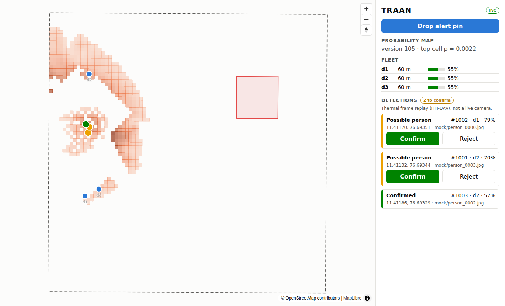
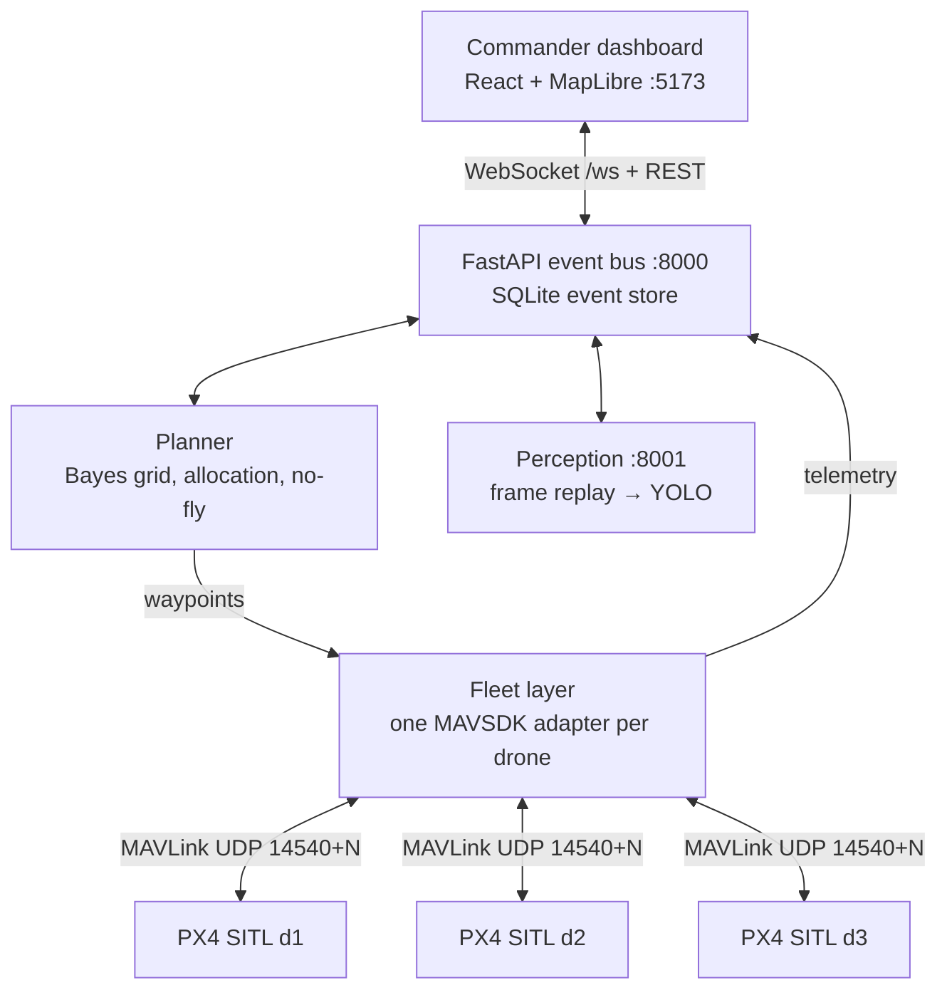

# TRAAN

**AI mission brain for drone and ground-robot search-and-rescue: Bayesian search, air–ground teaming, compliance by design.**

TRAAN decides where a search fleet should look next, coordinates several autonomous drones,
updates its probability map from what they did and didn't find, and leaves the final call to a human operator.

> Status: **Day 1 scaffold** for the Smart India Hackathon build (target `v0.5` on 14 Oct). Everything
> runs in simulation: PX4 SITL drones, HIT-UAV thermal frame replay. No real aircraft, no live camera.


<sub>Commander dashboard driven by the mock fleet (basemap tiles not loaded in this capture). Orange = probability
heatmap, red box = no-fly zone, blue = drones, amber/green = pending/confirmed detections.</sub>

## The Find loop

**Alert pin → prior heatmap → 3 PX4 drones fly the planner's waypoints → heatmap updates live →
a HIT-UAV thermal frame triggers a YOLO detection → operator confirms → map updates, search continues.**

## Architecture



Interface contracts (the four event types, coordinates, grid, ports, ownership rules) are frozen in
[`CLAUDE.md`](CLAUDE.md).

## Quick start

```bash
git clone https://github.com/rahulpravash-design/traan.git && cd traan
docker compose up            # api + mock fleet + dashboard, no PX4 needed
# open http://localhost:5173  → click "Drop alert pin", click the map
```

Without Docker:

```bash
pip install -r requirements.txt
./data/fetch.sh                                   # SRTM tile + OSM extract (optional; synthetic terrain otherwise)
uvicorn api.main:app --port 8000 &
python -m fleet.mock_feed --seed 1 --speedup 5 &
cd dashboard && npm install && npm run dev
```

With PX4 SITL (headless SIH, 3 drones):

```bash
docker compose --profile px4 up px4-sitl          # or: PX4_DIR=~/PX4-Autopilot ./fleet/px4_sitl.sh 3
pip install -r fleet/requirements.txt
python -m fleet.smoke_test --drones 3             # Day 1 check: arm, take off, land
```

Tests: `pytest` (21 tests: grid geometry, Bayes update, prior, allocation, no-fly routing, fast sim, API).

## What "50%" means

| # | Module | Weight | In the 50% build | Credit | Today |
|---|---|---|---|---|---|
| 1 | Scenario and world: Nilgiris DEM, OSM layers, synthetic victims | 5 | ✅ Full | 5 | Grid + SRTM loader + scenario generator done; OSM layers not yet used |
| 2 | Fleet control: 3× PX4 SITL, MAVSDK missions and telemetry | 15 | ✅ Full | 15 | Adapter, launch script, smoke test written; **not yet run against PX4** |
| 3 | Planner: Bayesian map, updates, allocation, fixed no-fly zones | 20 | ◐ No live re-planning, no LOS-only mode | 15 | Prior, Bayes update, greedy allocation, no-fly routing done in fast sim |
| 4 | Thermal perception: YOLO on HIT-UAV, frame replay in the loop | 15 | ◐ No multi-frame check, no Jetson/TensorRT | 5 | Training/eval scripts, replay, service written; **no model trained yet** |
| 5 | Commander dashboard | 10 | ◐ Map, live drones, heatmap, confirm queue | 5 | All four working on the mock feed |
| 6 | Benchmark harness and results | 10 | ◐ 100 runs + wrong-prior test, no CIs | 5 | Runner + chart done; first fast-sim run below |
| 7 | Comms-loss resilience: store-and-forward, relay drone | 10 | ❌ | 0 | — |
| 8 | Ground robot + kit drop | 5 | ❌ | 0 | — |
| 9 | Security: signed commands, JWT roles, audit log, sitreps | 10 | ❌ | 0 | Single command choke point in place (`api/commands.py`) |
| | **Total** | **100** | | **50** | |

Modules 7–9 and the half-finished parts are the 36-hour finale (sprints S3–S4).

## Benchmark (fast 2D sim, preliminary)

`python -m bench.run --runs 100` → [`bench/results/fastsim_100.csv`](bench/results/fastsim_100.csv).
SRTM terrain, 3 drones at 8 m/s, 50 m sensor strip, same seeds for both methods.
Victims come from a debris-runout model the planner never sees.

| Prior | Method | Median time to first find | IQR | Victims found ≤ 20 min | Runs with no find in 60 min |
|---|---|---|---|---|---|
| As built | Bayesian | 168 s | 136–200 s | 77.8% | 0 / 100 |
| As built | Grid sweep | 1226 s | 668–1411 s | 22.4% | 1 / 100 |
| Shifted 400 m | Bayesian | 660 s | 351–1092 s | 41.0% | **12 / 100** |
| Shifted 400 m | Grid sweep | 1226 s | 668–1411 s | 22.4% | 1 / 100 |


**Read this carefully.** Both the victim model and the prior are ours, so the "as built" gap is an
upper bound, not a field result. With a wrong prior, Bayes still wins on median, but **12% of runs find
nobody in an hour versus 1% for the grid sweep**: greedy search keeps working a wrong hotspot. Fixing that
tail (e.g. an exploration term, or a coverage floor) is open work. Not yet cross-checked in PX4 (Day 10).

## Repository layout

```
sim/          A  world frame, terrain, scenario generator, fast 2D sim
fleet/        B  PX4 SITL launch, MAVSDK adapter per drone, smoke test, mock feed
planner/      C  prior, Bayes update, allocation, no-fly zones, grid-sweep baseline
perception/   D  HIT-UAV prep, YOLO train/eval, frame replay, inference service
api/          B  FastAPI + WebSocket bus, SQLite event store, command choke point
dashboard/    E  React + MapLibre
bench/        C+F benchmark runner, results/*.csv, charts
data/            fetch.sh only (datasets are never committed)
docker/          Dockerfiles; docker-compose.yml at the root
docs/            plan, architecture, images
```

## Data sources and licences

| Data / dependency | Licence | Notes |
|---|---|---|
| NASA SRTM 1″ (via AWS Terrain Tiles) | Public domain | `data/fetch.sh` |
| OpenStreetMap | ODbL | Attribute "© OpenStreetMap contributors" |
| HIT-UAV thermal dataset | CC0 | Not committed; fetched by `data/fetch.sh hituav` |
| PX4, MAVSDK | BSD-3-Clause | Compatible with our Apache-2.0 |
| Ultralytics YOLOv8/11 | **AGPL-3.0** | Hackathon only; kept behind `perception/detector.py` so it can be swapped for an Apache-2.0 model before any OEM licensing |
| `mavsdk_drone_show` | PolyForm Noncommercial | **Do not copy code from it** |

TRAAN itself is Apache-2.0 (see [LICENSE](LICENSE)).

## Team and roadmap

Team **CTRL ALT ELITE**. One owner per module; 15-minute standup daily. Full plan: [`docs/PLAN.md`](docs/PLAN.md).

| Role | Owns |
|---|---|
| A: Simulation | PX4 SITL ×3, world origin, launch scripts, Docker |
| B: Fleet / API | MAVSDK adapters, FastAPI, WebSocket, SQLite |
| C: Planner (Rahul) | Prior, Bayes update, allocation, benchmark |
| D: Perception | HIT-UAV training, inference service, frame replay |
| E: Dashboard | React + MapLibre |
| F: Integration + pitch | Scenario data, daily integration checks, README, video, deck |

After `v0.5`: comms-loss handling (store-and-forward, relay drone), ground robot + kit drop,
signed commands with JWT roles, 2-of-3 frame confirmation, ONNX → TensorRT on Jetson.

## Contributing

- `main` is always demo-able. CI runs `pytest` and the dashboard build on every PR.
- Branches: `<owner-letter>/<module>`, e.g. `c/bayes-update`.
- Integration #1 (Day 5) and #2 (Day 7) merge by PR with one reviewer who isn't the author.
- Tag `v0.5` on Day 11; repo goes public on Day 14.
