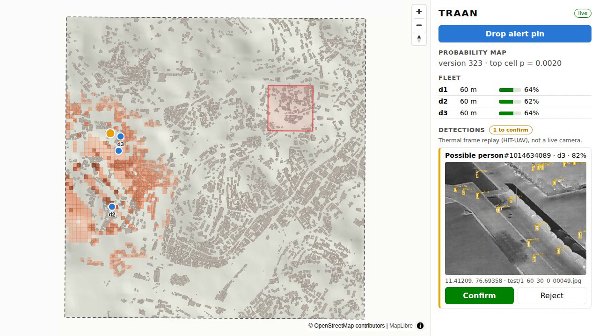
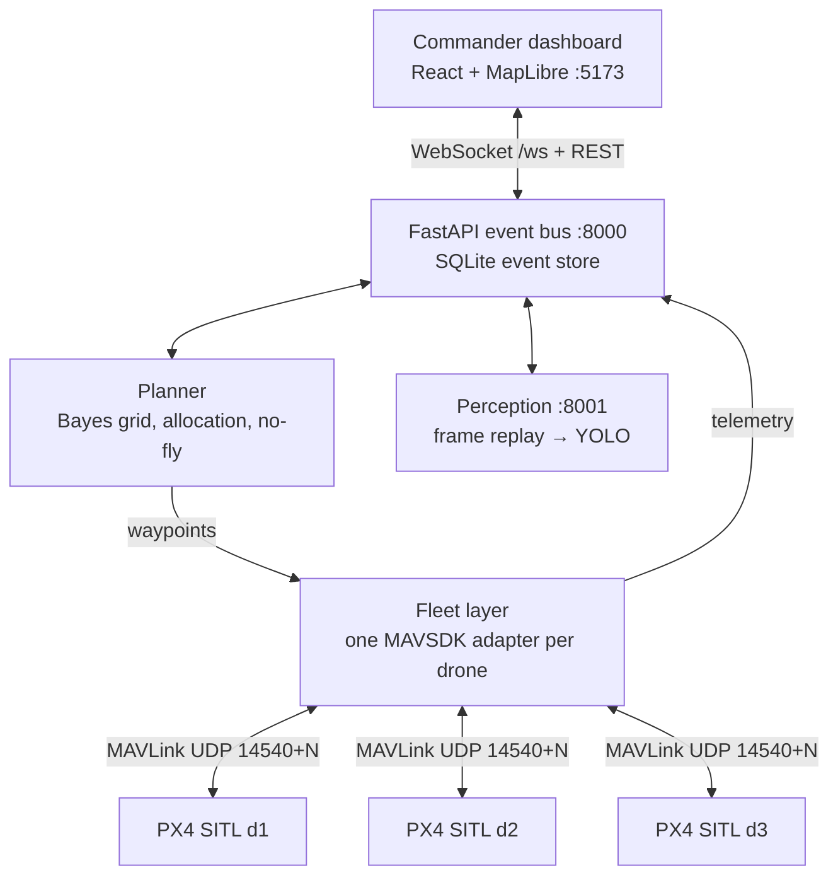
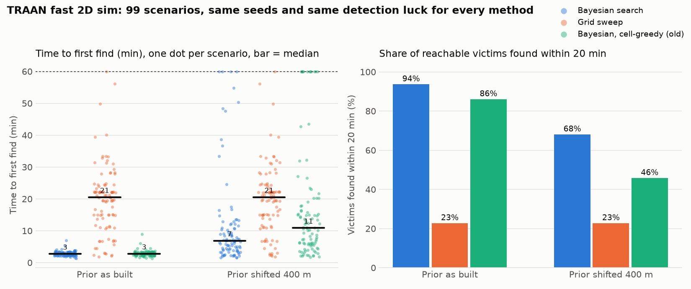

# TRAAN

**AI mission brain for drone and ground-robot search-and-rescue: Bayesian search, air–ground teaming, compliance by design.**

TRAAN decides where a search fleet should look next, coordinates several autonomous drones,
updates its probability map from what they did and didn't find, and leaves the final call to a human operator.

> Status: **≈50% of the prototype: 6 of 9 modules working** (table below), ahead of the 14-day plan.
> The Find loop runs end to end on 3 PX4 SITL drones with a YOLOv8n detector trained on HIT-UAV
> (test mAP50 0.900). Everything is simulation: PX4 SITL and thermal *frame replay*. No real aircraft,
> no live camera.

**Demo video (2:30):** https://claude.ai/artifact/M85fGSSw6ac5yXEnF12hbk (recorded from a real run; see [docs/demo](docs/demo/README.md))


<sub>A frame from the demo recording: 3 PX4 SITL drones (blue) searching Ooty. A drone's footprint crossed a hidden
victim, the replay mapper sent a real HIT-UAV test frame, and YOLO boxed the people (82%). The operator is about to
confirm. Orange = probability heatmap (searched cells fade), red box = no-fly zone. The base map is drawn offline from
SRTM terrain and building footprints.</sub>

## The Find loop

**Alert pin → prior heatmap → 3 PX4 drones fly the planner's waypoints → heatmap updates live →
a HIT-UAV thermal frame triggers a YOLO detection → operator confirms → map updates, search continues.**

## Architecture



There is one live planner, inside the API. Fleets (the mock today, PX4 via `fleet/run.py` from Day 4)
post telemetry, which the planner turns into negative-information map updates, and ask
`POST /planner/next` for each drone's next leg. Interface contracts (the four event types, the live-loop
REST calls, coordinates, grid, ports, ownership rules) are frozen in [`CLAUDE.md`](CLAUDE.md).

## Quick start

```bash
git clone https://github.com/rahulpravash-design/traan.git && cd traan
docker compose up            # api + mock fleet + dashboard, no PX4 needed
# open http://localhost:5173  → the mock fleet sends a scenario alert and starts searching;
# "Drop alert pin" re-centres the search (the mock's hidden victims stay where they are)
```

Without Docker:

```bash
pip install -r requirements.txt
./data/fetch.sh                                   # SRTM tile + OSM extract (optional; synthetic terrain otherwise)
uvicorn api.main:app --port 8000 &
python -m fleet.mock_feed --seed 1 --speedup 5 &   # add --wait-for-pin to start from your own pin
cd dashboard && npm install && npm run dev
```

With PX4 SITL (headless SIH, 3 drones):

```bash
docker compose --profile px4 up px4-sitl          # or: PX4_DIR=~/PX4-Autopilot ./fleet/px4_sitl.sh 3
pip install -r fleet/requirements.txt
python -m fleet.smoke_test --drones 3             # Day 1 check: arm, take off, land
python -m fleet.run --drones 3                    # live loop: fly the API planner's legs (Day 4 check)
```

Verified on PX4 v1.15.4 SITL (SIH, headless, Ubuntu 24.04): the smoke test passes and 3 drones fly the
planner's legs from Ooty. Shallow clones need `git -C platforms/nuttx/NuttX/nuttx tag nuttx-11.0.0` before
`make`, and `mavsdk` must stay `<4` (v4 is a different API).

Real detection path (replay mapper → perception → detection), with the mock fleet or PX4:

```bash
uvicorn perception.service:app --port 8001 &      # needs data/hituav_person (data/fetch.sh hituav)
python -m fleet.mock_feed --fleet-only &          # or: python -m fleet.run --drones 3
python -m sim.replay_mapper --seed 1              # owns the hidden victims, sends the alert + frames
```

Tests: `pytest` (33 tests: grid geometry, Bayes update, prior, allocation, sweep tracking, no-fly routing, fast sim, API, live loop, replay mapper and perception plumbing).

## What "50%" means

| # | Module | Weight | In the 50% build | Credit | Today |
|---|---|---|---|---|---|
| 1 | Scenario and world: Nilgiris DEM, OSM layers, synthetic victims | 5 | ✅ Full | 5 | **5** · SRTM terrain, real building footprints (11,960 around Ooty), scenario generator. Buildings come from **Google Open Buildings**, because OSM servers were unreachable from the build environment; the OSM loader takes over when `data/osm.json` exists |
| 2 | Fleet control: 3× PX4 SITL, MAVSDK missions and telemetry | 15 | ✅ Full | 15 | **15** · verified on PX4 SITL: smoke test, 3 drones flying planner legs, 2 Hz telemetry |
| 3 | Planner: Bayesian map, updates, allocation, fixed no-fly zones | 20 | ◐ No live re-planning, no LOS-only mode | 15 | **15** · prior, Bayes update, leg-scoring allocation, no-fly routing; drives PX4 live through the API |
| 4 | Thermal perception: YOLO on HIT-UAV, frame replay in the loop | 15 | ◐ No multi-frame check, no Jetson/TensorRT | 5 | **5** · YOLOv8n on HIT-UAV person class, **test mAP50 0.900** (P 0.873, R 0.848); real frames replayed in the PX4 loop |
| 5 | Commander dashboard | 10 | ◐ Map, live drones, heatmap, confirm queue | 5 | **5** · all four working on PX4 and the mock fleet, incl. the detection's frame |
| 6 | Benchmark harness and results | 10 | ◐ 100 runs + wrong-prior test, no CIs | 5 | **5** · 100 runs + wrong prior + ablation; PX4 cross-check on 3 scenarios agrees within 7–11% |
| 7 | Comms-loss resilience: store-and-forward, relay drone | 10 | ❌ | 0 | — |
| 8 | Ground robot + kit drop | 5 | ❌ | 0 | — |
| 9 | Security: signed commands, JWT roles, audit log, sitreps | 10 | ❌ | 0 | 0 · single command choke point in place (`api/commands.py`) |
| | **Total** | **100** | | **50** | **≈50** |

Modules 7–9 and the half-finished parts are the 36-hour finale (sprints S3–S4).

## Detector (module 4)

YOLOv8n fine-tuned on the HIT-UAV person class (2,029 training images, 15 epochs on CPU, starting from COCO
weights). Test split, 579 images ([`perception/metrics.json`](perception/metrics.json)):

| mAP50 | mAP50-95 | Precision | Recall |
|---|---|---|---|
| **0.900** | 0.463 | 0.873 | 0.848 |

In the loop the detector sees one replayed frame per look, so what matters is frame-level. At the chosen
threshold (conf ≥ 0.60, picked by `python -m perception.operating_point`), it catches **80% of frames with a
person**, the same detection probability per pass the benchmark assumes, and raises a false alarm on **1.8% of
person-free frames**. False alarms reach the operator as pending detections to reject; 2-of-3-frame
confirmation (post-50%) is what cuts them further. A 50-epoch GPU run (`docs/PLAN.md`, member D) should score
higher. Ultralytics is AGPL-3.0 and sits behind `perception/detector.py` so it can be swapped.

## Benchmark (fast 2D sim, preliminary)

`python -m bench.run --runs 100 --methods bayes,grid,bayes_cell` →
[`bench/results/fastsim_100.csv`](bench/results/fastsim_100.csv). SRTM terrain and real building footprints
(Google Open Buildings), 3 drones at 8 m/s, 50 m sensor strip, same seeds **and the same detection luck**
(pre-drawn per victim) for every method. Victims come from a debris-runout model the planner never sees.
49 victims landed inside the no-fly zone and are reported, not scored.

| Prior | Method | Median time to first find | IQR | Reachable victims found ≤ 20 min | Runs with no find in 60 min |
|---|---|---|---|---|---|
| As built | **Bayesian** | 174 s | 135–204 s | 91.8% | 0 / 100 |
| As built | Grid sweep | 1164 s | 420–1346 s | 24.4% | 0 / 100 |
| Shifted 400 m | **Bayesian** | 384 s | 236–563 s | 66.2% | **4 / 100** |
| Shifted 400 m | Grid sweep | 1164 s | 420–1346 s | 24.4% | 0 / 100 |
| As built | Bayesian, cell-greedy (old) | 174 s | 140–209 s | 87.8% | 0 / 100 |
| Shifted 400 m | Bayesian, cell-greedy (old) | 454 s | 259–840 s | 47.3% | 7 / 100 |



**Read this carefully.**
- Both the victim model and the prior are ours, so the "as built" gap is an upper bound, not a field result.
- With a 400 m wrong prior, Bayesian search is faster than the grid sweep in 80 of 100 paired scenarios,
  but **4 runs find nobody in an hour versus none for the grid sweep**. In those runs the planner, trusting
  its prior, re-searches the wrong area and covers only about two thirds of the grid in 60 min.
- The first planner (pick the best cell by P / distance) crawled in ~30 m overlapping hops and covered only
  36–44% of the area in an hour (7 no-find runs here, 12 with synthetic buildings). Scoring whole legs by
  probability swept per metre (`planner/allocate.py::assign_leg`) fixed most of that; the old planner stays in the table as an ablation.

### PX4 cross-check

`python -m bench.px4_check --seeds 1 2 3 --speed 4` flies the same scenarios with 3 PX4 SITL drones (SIH, 4×
lockstep) through the live API loop, scored with the fast sim's own sweep model and detection luck, so the only
difference is real flight: PX4 dynamics, stops at waypoints, telemetry latency
([`bench/results/px4_check.csv`](bench/results/px4_check.csv)).

| Seed | Bayesian: PX4 | Bayesian: fast sim | Grid sweep: PX4 | Grid sweep: fast sim |
|---|---|---|---|---|
| 1 | 181 s | 168 s | 1599 s | 1464 s |
| 2 | 235 s | 220 s | 1582 s | 1436 s |
| 3 | 134 s | 124 s | 1275 s | 1156 s |

PX4 is 7–11% slower than the fast sim in every run, and Bayesian search finds the first victim 7–10× sooner than the grid sweep on
both. One divergence: on seed 2 the fast sim found 2 of 3 victims within 20 min, PX4 only 1 (the others came at
about 23 min). Times are wall-clock × the 4× speed factor; the drones' measured ground speed implied 3.3–3.8×
(it also counts turns and accelerations), so the PX4 times may be slightly pessimistic.
These cross-check runs predate the real building footprints (synthetic hamlets), like any run without
`data/open_buildings_ooty.csv`.

## Repository layout

```
sim/          A  world frame, terrain, scenario generator, fast 2D sim
fleet/        B  PX4 SITL launch, MAVSDK adapter per drone, smoke test, mock feed
planner/      C  prior, Bayes update, allocation, no-fly zones, grid-sweep baseline
perception/   D  HIT-UAV prep, YOLO train/eval, frame replay, inference service
api/          B  FastAPI + WebSocket bus, SQLite event store, command choke point
dashboard/    E  React + MapLibre
bench/        C+F benchmark runner, results/*.csv, charts
data/            fetch.sh only (datasets are never committed)
docker/          Dockerfiles; docker-compose.yml at the root
docs/            plan, architecture, images
```

## Data sources and licences

| Data / dependency | Licence | Notes |
|---|---|---|
| NASA SRTM 1″ (via AWS Terrain Tiles) | Public domain | `data/fetch.sh` |
| OpenStreetMap | ODbL | Attribute "© OpenStreetMap contributors" |
| HIT-UAV thermal dataset (Suo et al., *Scientific Data* 10, 227, 2023) | CC BY 4.0 | Not committed; `data/fetch.sh hituav` clones the official repo. Cite the paper |
| Google Open Buildings v3 (Sirko et al., 2021) | CC BY 4.0 / ODbL | Building footprints when OSM is unreachable; `data/fetch.sh` streams just the grid's bounding box |
| PX4, MAVSDK | BSD-3-Clause | Compatible with our Apache-2.0 |
| Ultralytics YOLOv8/11 | **AGPL-3.0** | Hackathon only; kept behind `perception/detector.py` so it can be swapped for an Apache-2.0 model before any OEM licensing |
| `mavsdk_drone_show` | PolyForm Noncommercial | **Do not copy code from it** |

TRAAN itself is Apache-2.0 (see [LICENSE](LICENSE)).

## Team and roadmap

Team **CTRL ALT ELITE**. One owner per module; 15-minute standup daily. Full plan: [`docs/PLAN.md`](docs/PLAN.md).

| Role | Owns |
|---|---|
| A: Simulation | PX4 SITL ×3, world origin, launch scripts, Docker |
| B: Fleet / API | MAVSDK adapters, FastAPI, WebSocket, SQLite |
| C: Planner (Rahul) | Prior, Bayes update, allocation, benchmark |
| D: Perception | HIT-UAV training, inference service, frame replay |
| E: Dashboard | React + MapLibre |
| F: Integration + pitch | Scenario data, daily integration checks, README, video, deck |

After `v0.5`: comms-loss handling (store-and-forward, relay drone), ground robot + kit drop,
signed commands with JWT roles, 2-of-3 frame confirmation, ONNX → TensorRT on Jetson.

## Contributing

- `main` is always demo-able. CI runs `pytest` and the dashboard build on every PR.
- Branches: `<owner-letter>/<module>`, e.g. `c/bayes-update`.
- Integration #1 (Day 5) and #2 (Day 7) merge by PR with one reviewer who isn't the author.
- Tag `v0.5` on Day 11; repo goes public on Day 14.
